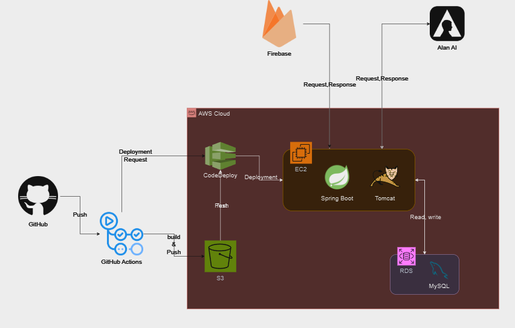
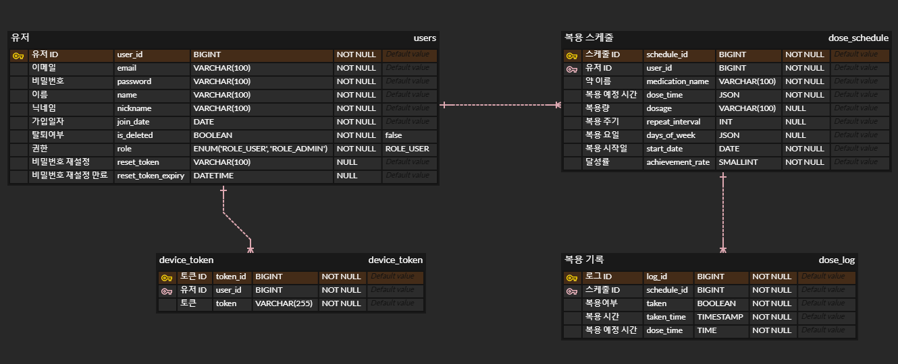

# 🐴 Project Dose 

## Tech Stack


### Backend


  
### Frontend


  
### Infrastructure


<br>


> 취업과 회사에 대해 자유롭게 이야기 할 수 있는 커뮤니티 👉 [[링크]](http://ormi-donkey.com/)


## 📖Description

- 누구나 쉽게 접근할 수 있는 사이트
- 자유롭게 표현할 수 있는 사이트
- 취업 정보를 제약없이 교류할 수 있는 사이트

취업 준비에 필요한 자료를 구할 수 있는 곳이 흔치 않고, 결제를 해야 자료를 열람할 수 있는 곳이 많습니다.

편하게 취준생들이 편하게 모여 이야기 하고, 취업에 성공한 선배님들과 대화하며, 누구에게나 열려있는 커뮤니티로 좋은 추억이 되었으면 좋겠습니다.


### 1. 💾**개발 환경**


- Java JDK 21, JavaScript
- 프론트엔드 : React, HTML, tailwind
- 백엔드 : Spring Boot
- 데이터베이스 : PostgreSQL
- ORM : JPA
- 배포환경 : AWS EC2, RDS
- 협업도구 : GitHub, Notion, Miro, ERD Cloud, Figma

### 2. 🤔**기능 정의서**

- 초안


- 완료


### 3. 🔎**개발 일정**


## ✨UI(화면) 설계서

- [피그마 링크 바로가기]([https://www.figma.com/design/MHo4sYaluH3V8VyPcu7vIo/Project_Dose?node-id=0-1&t=b6YrEvOq5R2sPcTE-1])

|                                                                                                                       |                                                                                                                       |
|-----------------------------------------------------------------------------------------------------------------------|-----------------------------------------------------------------------------------------------------------------------|
| Main Page (Member)                                                                                                    | Main Page (Guest)                                                                                                     |
|  |  |
| Login Page                                                                                                            | SignUp Page                                                                                                           |
|                                                                                                                       |                                                                                                                       |

## 📂Project Structure
```
📦src
 ┣ 📂main
 ┃ ┣ 📂java
 ┃ ┃ ┗ 📂com
 ┃ ┃ ┃ ┗ 📂estsoft
 ┃ ┃ ┃ ┃ ┗ 📂projectdose
 ┃ ┃ ┃ ┃ ┃ ┣ 📂admin
 ┃ ┃ ┃ ┃ ┃ ┃ ┣ 📂controller
 ┃ ┃ ┃ ┃ ┃ ┃ ┣ 📂dto
 ┃ ┃ ┃ ┃ ┃ ┃ ┗ 📂service
 ┃ ┃ ┃ ┃ ┃ ┣ 📂calendar
 ┃ ┃ ┃ ┃ ┃ ┃ ┣ 📂controller
 ┃ ┃ ┃ ┃ ┃ ┃ ┣ 📂dto
 ┃ ┃ ┃ ┃ ┃ ┃ ┣ 📂entity
 ┃ ┃ ┃ ┃ ┃ ┃ ┣ 📂repository
 ┃ ┃ ┃ ┃ ┃ ┃ ┗ 📂service
 ┃ ┃ ┃ ┃ ┃ ┣ 📂config
 ┃ ┃ ┃ ┃ ┃ ┣ 📂exception
 ┃ ┃ ┃ ┃ ┃ ┣ 📂fcm
 ┃ ┃ ┃ ┃ ┃ ┃ ┣ 📂config
 ┃ ┃ ┃ ┃ ┃ ┃ ┣ 📂controller
 ┃ ┃ ┃ ┃ ┃ ┃ ┣ 📂dto
 ┃ ┃ ┃ ┃ ┃ ┃ ┗ 📂service
 ┃ ┃ ┃ ┃ ┃ ┃ ┃ ┗ 📂impl
 ┃ ┃ ┃ ┃ ┃ ┣ 📂report
 ┃ ┃ ┃ ┃ ┃ ┃ ┣ 📂controller
 ┃ ┃ ┃ ┃ ┃ ┃ ┣ 📂dto
 ┃ ┃ ┃ ┃ ┃ ┃ ┗ 📂service
 ┃ ┃ ┃ ┃ ┃ ┣ 📂users
 ┃ ┃ ┃ ┃ ┃ ┃ ┣ 📂controller
 ┃ ┃ ┃ ┃ ┃ ┃ ┣ 📂dto
 ┃ ┃ ┃ ┃ ┃ ┃ ┣ 📂entity
 ┃ ┃ ┃ ┃ ┃ ┃ ┣ 📂exception
 ┃ ┃ ┃ ┃ ┃ ┃ ┣ 📂repository
 ┃ ┃ ┃ ┃ ┃ ┃ ┗ 📂service
 ┃ ┃ ┃ ┃ ┃ ┗ 📂util
 ┃ ┗ 📂resources
 ┃ ┃ ┣ 📂firebase
 ┃ ┃ ┣ 📂static
 ┃ ┃ ┃ ┣ 📂css
 ┃ ┃ ┃ ┣ 📂firebase
 ┃ ┃ ┃ ┣ 📂fonts
 ┃ ┃ ┃ ┣ 📂img
 ┃ ┃ ┃ ┗ 📂js
 ┃ ┃ ┣ 📂templates
 ┃ ┃ ┃ ┗ 📂common
 ┗ 📂test
```

## 🏭System Structure



## 🔐ERD Structure


## 🎈API 명세서

### 📁 Member
| 🏷NAME         | ⚙METHOD | 📎URL                         | 📖DESCRIPTION            |
|---------------------|---------|-------------------------------|--------------------------|
| withdrawal     | PUT     | /member/withdrawal            | 회원 탈퇴 요청           |
| modify         | PUT     | /member/modifyInfo            | 회원 정보 수정           |
| signup         | POST    | /member/register              | 회원 가입                |
| findPassword   | POST    | /member/findpassword          | 비밀번호 찾기            |
| changePassword | POST    | /member/changepassword        | 비밀번호 변경            |
| userInfo       | GET     | /member/userinfo              | 사용자 정보 조회         |
| userInfo_1     | GET     | /member/userinfo/{email}      | 이메일로 사용자 정보 조회|

### 📁 Document
| 🏷NAME              | ⚙METHOD | 📎URL                         | 📖DESCRIPTION |
|---------------------|---------|-------------------------------|---------------|
| increaseDocumentLike| PUT     | /document/{document_id}/like  | 게시글 좋아요 증가    |
| modifyDocument      | PUT     | /document/manage/{document_id}| 게시글 수정         |
| deleteDocument      | DELETE  | /document/manage/{document_id}| 게시글 삭제         |
| saveDocument        | POST    | /document/manage              | 게시글 저장         |
| showOneDocument     | GET     | /document/{document_id}       | 특정 게시글 조회      |
| showAllDocument     | GET     | /document/list/{board_id}     | 게시판별 모든 게시글 조회 |

### 📁 Comment
| 🏷NAME              | ⚙METHOD | 📎URL                         | 📖DESCRIPTION            |
|---------------------|---------|-------------------------------|--------------------------|
| showOneComment      | GET     | /comment/{comment_id}         | 특정 댓글 조회           |
| modifyComment       | PUT     | /comment/{comment_id}         | 댓글 수정                |
| deleteComment       | DELETE  | /comment/{comment_id}         | 댓글 삭제                |
| likeComment         | PUT     | /comment/{comment_id}/like    | 댓글 좋아요 처리         |
| saveComment         | POST    | /comment/{doc_id}             | 댓글 저장                |
| showCommentAll      | GET     | /comment/list/{doc_id}        | 게시글 ID로 모든 댓글 조회 |

### 📁 Viewership
| 🏷NAME              | ⚙METHOD | 📎URL                         | 📖DESCRIPTION            |
|---------------------|---------|-------------------------------|--------------------------|
| searchViewershipCount| GET    | /viewership/{doc_id}          | 게시글 조회수 조회         |
| updateViewershipCount| PUT    | /viewership/{doc_id}          | 게시글 조회수 업데이트     |

### 📁 Like
| 🏷NAME              | ⚙METHOD | 📎URL                         | 📖DESCRIPTION            |
|---------------------|---------|-------------------------------|--------------------------|
| searchLikeItCount   | GET     | /likeit/{uuid}                | 좋아요 수 조회           |
| updateLikeItCount   | PUT     | /likeit/{uuid}                | 좋아요 수 업데이트       |

### 📁 Report
| 🏷NAME              | ⚙METHOD | 📎URL                         | 📖DESCRIPTION            |
|---------------------|---------|-------------------------------|--------------------------|
| acceptReport        | PUT     | /admin/report/accept/{report_id}| 신고 승인 처리        |
| reportDocument      | POST    | /report/doc/{document_id}     | 게시글 신고                |
| reportComment       | POST    | /report/com/{comment_id}      | 댓글 신고                |
| showAllReport       | GET     | /admin/report                 | 모든 신고 내역 조회      |

### 📁 Admin
| 🏷NAME              | ⚙METHOD | 📎URL                         | 📖DESCRIPTION            |
|---------------------|---------|-------------------------------|--------------------------|
| updateBoardStatus   | PUT     | /admin/board                  | 게시판 상태 업데이트     |
| savePasswordQuestion| POST    | /admin/passwordquestion       | 비밀번호 질문 저장       |
| saveIndustry        | POST    | /admin/industry               | 산업 정보 저장           |

### 📁 Password Question
| 🏷NAME              | ⚙METHOD | 📎URL                         | 📖DESCRIPTION            |
|---------------------|---------|-------------------------------|--------------------------|
| searchPasswordQuestion| GET   | /passwordquestion             | 비밀번호 질문 조회       |

### 📁 Industry
| 🏷NAME              | ⚙METHOD | 📎URL                         | 📖DESCRIPTION            |
|---------------------|---------|-------------------------------|--------------------------|
| searchIndustry      | GET     | /industry                     | 산업 정보 조회           |

### 📁 Company
| 🏷NAME              | ⚙METHOD | 📎URL                         | 📖DESCRIPTION            |
|---------------------|---------|-------------------------------|--------------------------|
| bringCompanyDataById| GET     | /companydata/{com_id}         | 회사 ID로 회사 데이터 조회|
| bringCompanyDataByName| GET   | /companydata/name/{com_Name}  | 회사 이름으로 회사 데이터 조회|

### 📁 Board
| 🏷NAME              | ⚙METHOD | 📎URL                         | 📖DESCRIPTION            |
|---------------------|---------|-------------------------------|--------------------------|
| requestCreateBoard  | POST    | /board                        | 게시판 생성 요청         |
| searchBoard         | GET     | /board/{isApprove}            | 승인된 게시판 조회       |

## 🎞시연 영상

https://github.com/lth01/ormi-community/assets/139758405/a0ee498f-a7e4-4640-a62e-661d693c177f

https://github.com/lth01/ormi-community/assets/139758405/8b932928-b806-47aa-8b2b-f31235d78359

https://github.com/lth01/ormi-community/assets/139758405/9ab64b24-33f5-48f2-9f5f-c7e4e7e796d2

https://github.com/lth01/ormi-community/assets/139758405/2dad5efc-d509-4098-9f3b-79637befee37

https://github.com/lth01/ormi-community/assets/139758405/f846baef-432b-4e98-9525-312e34f93f10

https://github.com/lth01/ormi-community/assets/139758405/b959897c-04e2-4969-bff0-3e675c7735d3


## 🛠Coding Convention

### Java Convention

[자바 컨벤션](https://github.com/lth01/ormi-community/wiki/01-Java-Coding-Convention#java-coding-convention)

### 커밋 컨벤션

```
type : subject

body

footer
```

[기타 컨벤션](https://github.com/lth01/ormi-community/wiki/02-Other-Convention)

## 👨‍💻Participation Member
- 이태희
- 김요한
- 김경록
